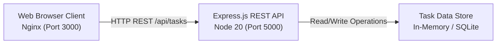

# Task Management System Architecture

## Component Topology

```mermaid
flowchart LR
    Browser["Web Browser Client<br/>Nginx (Port 3000)"]
    API["Express.js REST API<br/>Node 20 (Port 5000)"]
    Store["Task Data Store<br/>In-Memory / SQLite"]

    Browser -->|HTTP REST /api/tasks| API
    API -->|Read/Write Operations| Store
```
